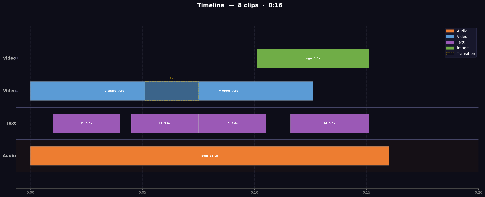

<p align="center">
  
</p>

<h1 align="center">KinetiX</h1>

<p align="center">
  <a href="LICENSE"></a>
  <a href="pyproject.toml"></a>
  <a href="README.md">English</a>
</p>

<p align="center">
  <strong>视频界的 LaTeX</strong> — 声明式视频编译引擎。
</p>

<p align="center">
  告别鼠标拖拽，纯代码剪大片。<br>
  不搞凭空生成，用逻辑控时间。<br>
  彻底摒弃界面，重塑极客体验。
</p>

<p align="center">
  
</p>

## 快速开始

**前置条件：** Python ≥ 3.10。[ffmpeg](https://ffmpeg.org/)（可选，仅 `--live` 预览需要）。

```bash
pip install kinetix-video
```

下载 [demo.ktx](demo.ktx) 和测试素材，然后：

```bash
kinetix demo.ktx                # 编译输出 demo.mp4
```

参与开发：

```bash
git clone git@github.com:Bruce-lhq/kinetix-video.git
cd kinetix-video
pip install -e .
```

## 命令行

```bash
kinetix <input.ktx> [output.mp4] [选项]

选项：
  --live                实时预览（通过 ffplay，无需编码）
  --preview START-END   渲染指定时间段，如 --preview 00:30-01:00
  --graph               生成时间轴拓扑图 PNG（不渲染视频）
  --no-subtitles        跳过 SRT 字幕渲染
```

## 模板变量

`.ktx` 支持 Jinja2 风格的 `{{ 变量 }}` 语法，用于批量视频生成：

```yaml
[t1]: text("{{ user.name }}，得分：{{ score }}", font: heiti, size: 56)
[v1]: {{ bg_video }}
[v1] @ 00:00 | duration: {{ duration }}s
```

```bash
# CLI 传单个变量
kinetix template.ktx --var user.name=Alice --var score=95

# CLI 从 JSON 文件加载
kinetix template.ktx --data vars.json

# Python API
from kinetix.main import compile_template
compile_template("template.ktx", {"user": {"name": "Alice"}, "score": 95})
```

安装时带上模板依赖：`pip install kinetix-video[template]`

## VS Code 扩展

`.ktx` 文件的语法高亮 + 单帧快照预览。

```bash
cp -r vscode-ktx ~/.vscode/extensions/ktx-syntax-0.2.0/
```

然后 `Cmd+Shift+P` → `Developer: Reload Window`。打开任意 `.ktx` 文件：

| 功能 | 操作 |
|------|------|
| 语法高亮 | 打开 `.ktx` 文件自动生效 |
| 帧快照 | `Ctrl+Shift+K` → 输入时间 → 侧边栏渲染该帧画面 |
| 命令面板 | `Cmd+Shift+P` → `KinetiX: Snapshot Frame at Time` |

快照命令可在任意时间点（如 `5`、`1:30`、`00:05`）渲染一帧全分辨率 PNG，用于快速检查画面效果。

## .ktx 语法

### 资源声明

```yaml
[v1]:  clips/video.mp4 [tag1, tag2]     # 带标签的视频
[img]: clips/photo.jpg [overlay]        # 图片
[bgm]: clips/music.mp3                  # 音频
[t1]:  text("第一行\n第二行", font: songti, bg_opacity: 0.5)
```

支持的格式：`.mp4` `.mov` `.avi` `.mkv` | `.jpg` `.jpeg` `.png` `.bmp` `.gif` | `.mp3` `.wav` `.aac` `.flac` `.m4a`

### 样式宏

```yaml
Define Style("intro"):
  fadein: 1s
  layer: 0
  transition: "crossfade", dur: 0.5s
  filter: "blackwhite"

[v1] @ 00:00 | style: "intro" | mute: true
```

支持的样式属性：`fadein` `fadeout` `transition` `volume` `mute` `layer` `anchor` `filter` `speed`。时间线条目上的显式值会覆盖样式默认值。

### 时间轴

```yaml
# 表达式时间 — 锚定到任意已命名的素材
[v2] @ v1.end - 1s | layer: 0
[a1] @ v1.start + 2s | layer: 0

# prev.end 链式排列（音频/视频独立追踪）
[v3] @ prev.end | layer: 0

# 分割：同一素材，不同片段
[v_part1] @ 00:00 | trim_start: 0s | trim_end: 5s
[v_part2] @ prev.end | trim_start: 5s | trim_end: 10s

# 音频避让角色
[voice] @ 00:00 | role: voice
[bgm]   @ 00:00 | role: bgm | volume: -20
```

### 时间轴属性

| 属性 | 值 | 说明 |
|------|----|------|
| `duration` | `10s` | 覆盖素材时长 |
| `layer` | `0`, `1`, … | Z 轴层级（0 = 最底层） |
| `pos` | `(x, y)` 或 `(50vw, 30vh)` | 像素坐标或相对位置 |
| `anchor` | `(0, 0)` | 相对锚点 |
| `style` | `"intro"` | 引用样式宏 |
| `crop` | `(x, y, w, h)` | 画面裁切 |
| `trim_start` | `2s` | 起始裁切 |
| `trim_end` | `8s` | 结束裁切 |
| `filter` | `"blackwhite"` | 全局滤镜 |
| `transition` | `"crossfade"` | 入场转场效果 |
| `fadein` / `fadeout` | `1s` | 淡入/淡出（视频+音频） |
| `mute` | `true` | 静音视频轨道 |
| `speed` | `2` | 播放速度（影响时间轴） |
| `volume` | `-28` | 音量（dB） |
| `role` | `voice` / `bgm` / `sfx` | 音频角色（用于避让） |

> `trim_start` + `duration` 可以组合使用，无需指定 `trim_end`：素材将覆盖 `[trim_start, trim_start + duration]` 区间。

### 位置单位（类 CSS）

`pos` 支持混合单位，更改输出分辨率时自动缩放：

| 单位 | 含义 | 示例 |
|------|------|------|
| `vw` | 画布宽度的 % | `50vw` = 画布宽度的一半 |
| `vh` | 画布高度的 % | `30vh` = 画布高度的 30% |
| `pw` | 素材宽度的 % | `10pw` = 图片/视频宽度的 10% |
| `ph` | 素材高度的 % | `5ph` |
| `px` / 数字 | 绝对像素 | `200px` = 200px |

```yaml
[img] @ 00:05 | pos: (50vw, 30vh)    # 相对单位
[img] @ 00:05 | pos: (100, 200)      # 绝对像素
```

### 锚点坐标

```yaml
anchor: (x, y)   # x, y ∈ [-1, 1]，屏幕坐标系（y↓）
```

| 坐标 | 位置 | 坐标 | 位置 | 坐标 | 位置 |
|------|------|------|------|------|------|
| `(-1,-1)` | 左上 | `(0,-1)` | 顶部居中 | `(1,-1)` | 右上 |
| `(-1, 0)` | 左中 | `(0, 0)` | **居中** | `(1, 0)` | 右中 |
| `(-1, 1)` | 左下 | `(0, 1)` | 底部居中 | `(1, 1)` | 右下 |

> 关键帧 `scale` 先于 anchor 生效。`pos` 优先级高于 `anchor`。

### 关键帧与缓动

```yaml
[img1]:
  scale:  { 0s: 0.5, 5s: 1.2, curve: "ease_in_out" }
  pos:    { 0s: (0,0), 5s: (200,100) }
  opacity:{ 0s: 0.0, 1s: 1.0, 4s: 1.0, 5s: 0.0 }
  rotate: { 0s: 0, 5s: 90 }
```

缓动曲线：`linear`（默认）| `ease_in` | `ease_out` | `ease_in_out`

### 滤镜

| 值 | 效果 |
|----|------|
| `blackwhite` | 灰度 |
| `invert` | 反色 |
| `mirror_x` | 水平翻转 |
| `mirror_y` | 垂直翻转 |
| `painting` | 油画效果 |

### 文字卡片

```yaml
[t]: text("内容", font: songti, size: 64, bg_opacity: 0.3, color: "#FFFFFF", stroke_width: 2, stroke_color: "#00000060")
```

参数可任意顺序排列。默认值：

| 参数 | 默认值 | 说明 |
|------|--------|------|
| `font` | `heiti` | `songti` / `heiti` |
| `size` | 自动 | 字号（px） |
| `bg_opacity` | `0.0` | 0=透明背景，1=实色背景 |
| `color` | `#FFFFFF` | 文字颜色 |
| `bg` | `#000000` | 背景颜色 |
| `stroke_width` | `0` | 文字描边宽度（px） |
| `stroke_color` | `#000000` | 描边颜色（支持透明度：`#00000060`） |

自动换行，`\n` 手动换行。文字片段以自然尺寸渲染（透明 RGBA），默认居中。使用 `opacity` 关键帧实现真正的透明淡入淡出。

### 字幕

```yaml
Subtitles: subtitles.srt
```

标准 SRT 格式，渲染在画面底部。

### 输出配置

```yaml
Format: mp4, Res: 1080p, FPS: 30
```

分辨率选项：`480p` `720p` `1080p` `4k`

## 完整示例

查看仓库中的 [`demo.ktx`](demo.ktx) — 一个包含文字叠加、缓动关键帧和实时预览的多场景宣传片。运行：

```bash
kinetix demo.ktx              # 编译输出 demo.mp4
kinetix demo.ktx --live       # ffplay 实时预览
kinetix demo.ktx --graph      # 生成时间轴拓扑图
```

展示全部核心功能的最小示例：

```yaml
Define Style("cinematic"):
  layer: 0
  transition: "crossfade", dur: 2.4s

[v1]: test_assets/v_chaos.mp4
[v2]: test_assets/v_order.mp4
[logo]: test_assets/logo.png
[bgm]: test_assets/bgm_epic.mp3
[t1]: text("告别鼠标拖拽，纯代码剪大片", font: songti, size: 64,
           stroke_width: 2, stroke_color: "#00000060")

[bgm] @ 00:00 | volume: -10 | trim_start: 24s | duration: 16s | fadein: 1s | fadeout: 3s
[v1]  @ 00:00 | style: "cinematic" | mute: true | duration: 7.5s
[t1]  @ 1s    | duration: 3s
[v2]  @ v1.end - 2.4s | style: "cinematic" | mute: true | duration: 7.5s
[logo] @ v2.end - 2.5s | layer: 1 | duration: 5s

[v1]:
  scale: { 0s: 1.0, 7.5s: 1.12, curve: "ease_in" }

[t1]:
  scale: { 0s: 0.85, 3s: 1.0, curve: "ease_out" }
  opacity: { 0s: 0.0, 0.6s: 1.0, 2.4s: 1.0, 3s: 0.0, curve: "ease_in_out" }

[logo]:
  scale: { 0s: 0.22, 1.8s: 0.35, curve: "ease_out" }
  rotate: { 0s: -18, 1.8s: 0, curve: "ease_out" }
  opacity: { 0s: 0.0, 1.0s: 1.0, curve: "ease_out" }

Format: mp4, Res: 1080p, FPS: 30
```

## 架构

```
parse(.ktx) → apply_styles → resolve_timeline → render(.mp4) | live_preview(ffplay) | graph(.png)
```

使用 `kinetix demo.ktx --graph` 生成时间轴拓扑图：



## 路线图 & 参与贡献

KinetiX 目前是一个精悍的 MVP——做好时间轴引擎这一件事。真正的重头戏在下面。这些方向中任何一项让你心动，欢迎直接提 PR。

### 变量驱动与模板化 ✅

Jinja2 模板语法，配合 Python API 批量喂数据。

```yaml
[t1]: text("{{ user.name }}，您的得分：{{ score }}", font: heiti, size: 56)
```

从 CSV 批量渲染几千条个性化视频。营销、招聘、客户触达——每个 SaaS 公司的刚需。

### 插件生态

暴露 Hook 接口，开发者无需修改核心即可编写自定义特效算子。

```yaml
[v1] | plugin: "edge_glow", radius: 5, intensity: 1.2
```

CV 研究者提供视觉算法，KinetiX 提供时间轴引擎。互惠共生，特效库指数增长。

### 硬件加速渲染后端

目前 KinetiX 通过 moviepy 在 CPU 上逐帧渲染。未来计划：写一个编译器，将 `.ktx` 直接转译为 FFmpeg 滤镜图，调用 NVENC / VideoToolbox 进行 GPU 原生速度编码。C++ 和 Rust 性能极客的主场。

### Web 在线游乐场

左边 Monaco 编辑器写 `.ktx`，右边 Wasm 驱动的实时视频预览。无需装 Python 就能体验「代码剪辑」。前端大佬的封神之地。

### 官方 LLM 绑定

```python
kinetix.ask("把这个视频节奏加快一倍，末尾加个淡出")
```

标准化的 Python API，让 LLM 直接读写 KinetiX 内存中的 AST。搞 AI Agent 的一看就懂。

---

哪个方向让你手痒？开个 Issue、参与讨论、或者直接发 PR。核心故意做得很小——就是为了让你有发挥空间。

## License

[MIT](LICENSE)
